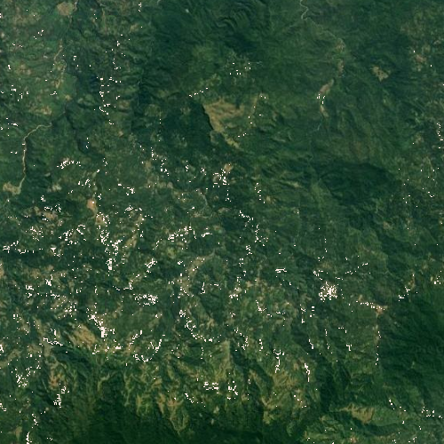

# clusterize

Tool for converting raster population data into polygon settlement clusters, primarily for use with [openelec](https://github.com/carderne/openelec).

From this             |  To this
:-------------------------:|:-------------------------:
  |  


## Usage
Use `./run.py` with one of the three sub-commads:
1. `prep` prepares a raster for clusterizing
2. `make` convert a raster into polygon clusters
3. `feat` adds features from other data sources

Example:

```
# Downsample to 0.001 degrees and remove average values below 1
./run.py prep pop_in.tif pop_out.tif --res 0.001 --min_val 1

# Create clusters using radiusneighbors method, radius 3
# and buffering by 100 metres before merging
./run.py make --method radius --radius 3 --buffer 100 pop_prepped.tif clusters.gpkg

# Add features as using a config file
# Example in features.yml
./run.py feat --config features.yml clusters.gpkg clusters_out.gpkg
```

## Requirements
- `numpy`
- `pandas`
- `scipy`
- `scikit-learn`
- `rasterio`
- `rasterstats`
- `shapely`
- `geopandas`
- `PyYAML`
- `Click`

## Installation
Clone from GitHub, install requirements into a virtual environment, and use the `./run.py` script as described above.

